# HairFastGAN Video Processing Pipeline

Complete documentation with visual Mermaid diagrams for the video processing pipeline with HairFastGAN and FPS enhancement.

---

## Table of Contents

1. [Complete Pipeline Overview](#complete-pipeline-overview)
2. [Step 1: Video Capture](#step-1-video-capture)
3. [Step 2: Preprocessing](#step-2-preprocessing)
4. [Step 3: HairGAN Processing](#step-3-hairgan-processing)
5. [Step 4: FPS Enhancement](#step-4-fps-enhancement)
6. [Data Flow & File Sizes](#data-flow--file-sizes)
7. [Decision Tree](#decision-tree)
8. [File Organization](#file-organization)
9. [Configuration Options](#configuration-options)
10. [Usage Patterns](#usage-patterns)

---

## Complete Pipeline Overview

```mermaid
graph LR
    A[📷 Webcam<br/>30fps] --> B[📹 Raw Video<br/>300 frames]
    B --> C[🔧 Preprocess<br/>5fps, 50 frames]
    C --> D[🎨 HairGAN<br/>Style Transfer]
    D --> E[⚡ FPS Enhance<br/>10fps, 100 frames]
    E --> F[🎬 Final Video<br/>30fps smooth]
    
    style A fill:#e1f5ff,stroke:#0288d1
    style B fill:#fff9c4,stroke:#f9a825
    style C fill:#f3e5f5,stroke:#7b1fa2
    style D fill:#fff3e0,stroke:#f57c00
    style E fill:#e8f5e9,stroke:#388e3c
    style F fill:#c8e6c9,stroke:#2e7d32
```



**Pipeline Summary:**
- **Input:** 10 seconds @ 30fps = 300 frames
- **After Preprocessing:** 50 frames @ 5fps (6x reduction)
- **After HairGAN:** 50 styled frames
- **After Enhancement:** 100 frames @ 10fps (2x interpolation)
- **Final Output:** Smooth 30fps video

---

## Step 1: Video Capture

```mermaid
graph TB
    Start([Start Capture]) --> Webcam[📷 Webcam Input]
    Webcam --> CaptureModule[camera_capture.py<br/>CameraCapture.capture_video]
    
    CaptureModule --> Settings{Configuration}
    Settings --> Duration[Max Duration: 10s]
    Settings --> Resolution[Resolution: 640x480]
    Settings --> FPS[Frame Rate: 30 FPS]
    Settings --> Format[Format: MP4]
    Settings --> Control[Manual Stop: Press 'q']
    
    Duration --> Process[Recording...]
    Resolution --> Process
    FPS --> Process
    Format --> Process
    Control --> Process
    
    Process --> Output[📹 captured_video.mp4<br/>~300 frames<br/>Size: 5-10 MB]
    Output --> Next([To Preprocessing])
    
    style Webcam fill:#e1f5ff,stroke:#0288d1
    style CaptureModule fill:#bbdefb,stroke:#1976d2
    style Output fill:#fff9c4,stroke:#f9a825
    style Settings fill:#e3f2fd,stroke:#42a5f5
```



**Key Features:**
- Real-time webcam capture
- Configurable duration (default: 10 seconds)
- Standard HD resolution
- Standard video FPS
- Manual stop capability

**Code Location:** `camera_capture.py`

**Main Function:** `CameraCapture.capture_video()`

---

## Step 2: Preprocessing

```mermaid
graph TB
    Input[📹 captured_video.mp4<br/>300 frames @ 30fps] --> Preprocessor[video_preprocessor.py<br/>VideoPreprocessor.extract_frames]
    
    Preprocessor --> FPSReduce{FPS Reduction<br/>6x}
    FPSReduce --> TargetFPS[Target: 5 FPS<br/>Extract every 6th frame]
    
    Preprocessor --> Resize{Resize Frames}
    Resize --> Width[Width: 512px<br/>Maintain aspect ratio]
    
    Preprocessor --> Quality{JPEG Compression}
    Quality --> JPEGQual[Quality: 95]
    
    TargetFPS --> Process[Frame Extraction<br/>& Processing]
    Width --> Process
    JPEGQual --> Process
    
    Process --> Frames[📂 preprocessed_frames/<br/>├─ frame_00000.jpg<br/>├─ frame_00001.jpg<br/>├─ ...<br/>└─ frame_00049.jpg]
    
    Frames --> Stats[~50 frames @ 5fps<br/>Size: 2-3 MB total]
    Stats --> Next([To HairGAN Processing])
    
    style Input fill:#fff9c4,stroke:#f9a825
    style Preprocessor fill:#f3e5f5,stroke:#7b1fa2
    style Frames fill:#fce4ec,stroke:#c2185b
    style Process fill:#f8bbd0,stroke:#880e4f
```



**Processing Steps:**
1. **FPS Reduction:** 30fps → 5fps (extract every 6th frame)
2. **Resize:** Scale to 512px width (maintain aspect ratio)
3. **Compression:** Save as JPEG with quality 95
4. **Output:** ~50 frames ready for processing

**Benefits:**
- Reduces processing time by 6x
- Maintains visual quality
- Reduces storage requirements
- Optimizes for HairGAN processing

**Code Location:** `video_preprocessor.py`

**Main Function:** `VideoPreprocessor.extract_frames()`

---

## Step 3: HairGAN Processing
```mermaid
graph TB
    Input[📂 preprocessed_frames/<br/>50 frames] --> Processor[hair_gan_processor.py<br/>HairGANProcessor.process_frames_batch]
    
    Processor --> LoopStart{For Each Frame}
    
    LoopStart -->|Process Frame| Step1[1. Face Detection<br/>Locate facial landmarks]
    Step1 --> Step2[2. Hair Segmentation<br/>Isolate hair region]
    Step2 --> Step3[3. Style Transfer<br/>Apply HairFastGAN model]
    Step3 --> Step4[4. Blend Result<br/>Merge with original]
    
    Step4 --> SaveFrame[Save Styled Frame]
    SaveFrame --> Check{More Frames?}
    Check -->|Yes| LoopStart
    Check -->|No| AllDone[All Frames Processed]
    
    Processor --> Options[Processing Options]
    Options --> Reference[Reference Style Image<br/>optional]
    Options --> Batch[Batch Processing]
    Options --> GPU[GPU Acceleration<br/>if available]
    
    AllDone --> Output[📂 processed_frames/<br/>frame_00000.jpg STYLED<br/>frame_00001.jpg STYLED<br/>frame_00049.jpg STYLED]
    
    Output --> Stats[~50 styled frames<br/>Size: 3-4 MB total]
    Stats --> Next([To FPS Enhancement])
    
    style Input fill:#fce4ec,stroke:#c2185b
    style Processor fill:#fff3e0,stroke:#f57c00
    style LoopStart fill:#ffe0b2,stroke:#e64a19
    style Check fill:#ffe0b2,stroke:#e64a19
    style Step1 fill:#ffecb3,stroke:#ff6f00
    style Step2 fill:#ffecb3,stroke:#ff6f00
    style Step3 fill:#ffecb3,stroke:#ff6f00
    style Step4 fill:#ffecb3,stroke:#ff6f00
    style SaveFrame fill:#ffecb3,stroke:#ff6f00
    style Output fill:#fff8e1,stroke:#ffa000

**HairGAN Pipeline:**
1. **Face Detection:** Identify facial features and landmarks
2. **Hair Segmentation:** Isolate the hair region from the face
3. **Style Transfer:** Apply HairFastGAN model transformation
4. **Blending:** Seamlessly merge styled hair with original frame

**Features:**
- Batch processing for efficiency
- GPU acceleration support
- Optional reference style image
- Preserves facial features
- Natural blending

**Code Location:** `hair_gan_processor.py`

**Main Functions:** 
- `HairGANProcessor.load_model()`
- `HairGANProcessor.process_frame()`
- `HairGANProcessor.process_frames_batch()`

---

## Step 4: FPS Enhancement

```mermaid
graph TB
    Input[📂 processed_frames/<br/>50 frames @ 5fps] --> Enhancer[fps_enhancer.py<br/>FPSEnhancer.enhance_fps]
    
    Enhancer --> Config{Configuration}
    Config --> Multiplier[FPS Multiplier: 2x<br/>5fps → 10fps]
    Config --> Method{Interpolation Method}
    
    Method --> Optical[optical_flow<br/>Best Quality]
    Method --> Linear[linear<br/>Balanced]
    Method --> Duplicate[duplicate<br/>Fastest]
    
    Multiplier --> Process[Frame Interpolation]
    Optical --> Process
    Linear --> Process
    Duplicate --> Process
    
    Process --> Loop{For Each Frame Pair}
    Loop --> Flow[Calculate Optical Flow]
    Flow --> Generate[Generate Intermediate Frames]
    Generate --> Smooth[Apply Smoothing]
    Smooth --> Check{More Pairs?}
    Check -->|Yes| Loop
    Check -->|No| Enhanced
    
    Enhanced[📂 enhanced_frames/<br/>├─ enhanced_frame_00000.jpg<br/>├─ enhanced_frame_00001.jpg INTERPOLATED<br/>├─ enhanced_frame_00002.jpg<br/>├─ ...<br/>└─ enhanced_frame_00099.jpg]
    
    Enhanced --> Stats[~100 frames @ 10fps<br/>Size: 6-8 MB]
    Stats --> Compile[FPSEnhancer.create_smooth_video]
    
    Compile --> VideoConfig[Output FPS: 30<br/>Codec: MP4V]
    VideoConfig --> Final[🎬 final_output.mp4<br/>Smooth 30fps<br/>Size: 5-8 MB]
    
    Final --> Complete([Pipeline Complete!])
    
    style Input fill:#fff8e1,stroke:#ffa000
    style Enhancer fill:#e8f5e9,stroke:#388e3c
    style Process fill:#c8e6c9,stroke:#2e7d32
    style Enhanced fill:#dcedc8,stroke:#689f38
    style Final fill:#aed581,stroke:#558b2f
```

**Enhancement Process:**
1. **Frame Interpolation:** Generate intermediate frames between existing frames
2. **Optical Flow:** Calculate motion vectors for smooth transitions
3. **2x Multiplier:** Double the frame count (50 → 100 frames)
4. **Video Compilation:** Create final 30fps video

**Interpolation Methods:**
- **optical_flow:** Best quality, motion-aware interpolation
- **linear:** Balanced performance and quality
- **duplicate:** Fastest, simple frame duplication

**Code Location:** `fps_enhancer.py`

**Main Functions:**
- `FPSEnhancer.enhance_fps()`
- `FPSEnhancer.interpolate_frames_optical_flow()`
- `FPSEnhancer.create_smooth_video()`

---

## Data Flow & File Sizes


**Storage Requirements:**
- **Peak Usage:** ~25-35 MB (all intermediate files)
- **Final Output:** 5-8 MB
- **Cleanup Option:** Remove intermediate frames to save space

---

## Decision Tree


---

## File Organization

```mermaid
graph TB
    Root[hairService/]
    
    Root --> Main[📄 main.py<br/>Complete pipeline]
    Root --> Examples[📄 examples.py<br/>Interactive menu]
    Root --> Config[📄 config.py<br/>Configuration]
    
    Root --> Step1[📄 camera_capture.py<br/>Step 1: Capture]
    Root --> Step2[📄 video_preprocessor.py<br/>Step 2: Preprocess]
    Root --> Step3[📄 hair_gan_processor.py<br/>Step 3: HairGAN]
    Root --> Step4[📄 fps_enhancer.py<br/>Step 4: Enhance]
    
    Root --> Utils[📄 video_utils.py<br/>Utility functions]
    Root --> Quick[📄 quick_reference.py<br/>Code snippets]
    
    Root --> Docs1[📄 README_PIPELINE.md<br/>Documentation]
    Root --> Docs2[📄 SUMMARY.py<br/>Project summary]
    Root --> Docs3[📄 FLOWCHART.py<br/>This flowchart]
    
    Root --> Output[📁 output/]
    Output --> Out1[captured_video.mp4]
    Output --> Out2[📁 preprocessed_frames/]
    Output --> Out3[📁 processed_frames/]
    Output --> Out4[📁 enhanced_frames/]
    Output --> Out5[final_output.mp4]
    
    style Root fill:#e3f2fd,stroke:#1976d2
    style Main fill:#c8e6c9,stroke:#388e3c
    style Output fill:#fff9c4,stroke:#f9a825
```



---

## Configuration Options

### Performance Profiles

| Parameter | Fast | Default | High Quality |
|-----------|------|---------|--------------|
| **Capture Time** | 5s | 10s | 10s |
| **Preprocess FPS** | 3 | 5 | 10 |
| **Resize Width** | 256px | 512px | 1024px |
| **FPS Multiplier** | 2x | 2x | 3x |
| **Interpolation** | linear | optical_flow | optical_flow |
| **Output FPS** | 24 | 30 | 60 |
| **Processing Time** | ~15s | ~48s | ~120s |

### Timing Breakdown


**Estimated Times:**
- **Step 1:** 10s (user interaction)
- **Step 2:** ~3s (frame extraction)
- **Step 3:** ~25s (model dependent)
- **Step 4:** ~10s (interpolation)
- **Total:** ~48s

*Note: Times vary based on hardware, resolution, and settings*

---

## Usage Patterns

### Pattern 1: Complete Pipeline (Easiest)

```python
python main.py
```

Runs the entire pipeline with default settings.

### Pattern 2: Interactive Menu

```python
python examples.py
```

Provides an interactive menu to run different parts of the pipeline.

### Pattern 3: Custom Configuration

```python
from main import run_pipeline_custom

run_pipeline_custom(
    camera_max_duration=5,
    fps_multiplier=3,
    resize_width=1024
)
```

### Pattern 4: Step-by-Step Execution

```python
from camera_capture import capture_video_simple
from video_preprocessor import preprocess_video
from hair_gan_processor import process_video_frames
from fps_enhancer import enhance_video_fps

# Step 1: Capture
capture_video_simple(10, "video.mp4")

# Step 2: Preprocess
preprocess_video("video.mp4", "frames")

# Step 3: HairGAN
process_video_frames("frames", "processed")

# Step 4: Enhance
enhance_video_fps("processed", "enhanced", output_video="final.mp4")
```

### Pattern 5: Skip Capture (Use Existing Video)

```python
from video_preprocessor import preprocess_video
from hair_gan_processor import process_video_frames
from fps_enhancer import enhance_video_fps

preprocess_video("my_video.mp4", "frames")
process_video_frames("frames", "processed")
enhance_video_fps("processed", "enhanced", output_video="final.mp4")
```

---

## Integration Points

### HairFastGAN Integration

```python
# File: hair_gan_processor.py
class HairGANProcessor:
    def load_model(self):
        # TODO: Add HairFastGAN model loading code here
        pass
    
    def process_frame(self, frame):
        # TODO: Add HairFastGAN inference code here
        pass
```

### Custom Preprocessing

```python
# File: video_preprocessor.py
class VideoPreprocessor:
    def extract_frames(self):
        # Modify frame extraction logic here
        pass
```

### Custom Interpolation

```python
# File: fps_enhancer.py
class FPSEnhancer:
    def interpolate_frames_custom(self):
        # Add custom interpolation method here
        pass
```

---

## Quick Start Guide

### 1. Install Dependencies

```bash
pip install opencv-python numpy
```

### 2. Run Complete Pipeline

```bash
python main.py
```

### 3. Check Output

```bash
ls output/final_output.mp4
```

---

## 🚀 Complete Setup Guide (New Laptop/Clone)

### Prerequisites

Before starting, ensure you have:
- Python 3.8 or higher
- Git
- Webcam (for video capture)
- 2-4 GB free disk space

### Step-by-Step Installation

#### 1. Clone the Repository

```bash
# Navigate to your projects directory
cd ~/My/Dev/Projects/App/glowup/server/services/

# Clone or copy the hairService directory
# If using git:
git clone <your-repo-url> hairService
# OR if copying from another location:
# cp -r /path/to/hairService ./hairService

# Navigate to the project
cd hairService
```

#### 2. Create Virtual Environment

```bash
# Create virtual environment
python3 -m venv .venv

# OR if python3 doesn't work, try:
python -m venv .venv
```

#### 3. Activate Virtual Environment

**On Linux/Mac:**
```bash
source .venv/bin/activate
```

**On Windows:**
```bash
# Command Prompt
.venv\Scripts\activate.bat

# PowerShell
.venv\Scripts\Activate.ps1
```

**Verify activation:**
You should see `(.venv)` at the beginning of your terminal prompt:
```bash
(.venv) username@laptop:~/hairService$
```

#### 4. Upgrade pip

```bash
pip install --upgrade pip
```

#### 5. Install Dependencies

```bash
# Install from requirements file
pip install -r requirements_pipeline.txt

# OR install manually:
pip install opencv-python>=4.5.0
pip install opencv-contrib-python>=4.5.0
pip install numpy>=1.19.0
pip install Pillow>=8.0.0
pip install torch>=1.9.0
pip install torchvision>=0.10.0
```

**Note:** If you don't need PyTorch (for HairFastGAN), you can skip torch and torchvision.

#### 6. Verify Installation

```bash
# Check Python version
python --version

# Verify OpenCV installation
python -c "import cv2; print(f'OpenCV version: {cv2.__version__}')"

# Verify NumPy installation
python -c "import numpy; print(f'NumPy version: {numpy.__version__}')"

# Check if camera is available
python -c "from video_utils import verify_camera_available; verify_camera_available()"
```

#### 7. Run the Pipeline

**Option A: Complete Pipeline (Interactive)**
```bash
python main.py
```

**Option B: Examples Menu**
```bash
python examples.py
```

**Option C: Quick Test (5 seconds)**
```bash
python -c "from main import run_pipeline_custom; run_pipeline_custom(camera_max_duration=5)"
```

#### 8. Check Output

```bash
# List output files
ls -lh output/

# View final video (Linux with VLC)
vlc output/final_output.mp4

# OR use default video player
xdg-open output/final_output.mp4
```

### Troubleshooting Installation

#### Issue: Python not found
```bash
# Try these alternatives:
python3 --version
python3.8 --version
python3.9 --version
python3.10 --version

# Use the one that works to create venv
python3.10 -m venv .venv
```

#### Issue: pip not found after activation
```bash
# Deactivate and reactivate
deactivate
source .venv/bin/activate

# OR install pip in venv
python -m ensurepip --upgrade
```

#### Issue: OpenCV installation fails
```bash
# Try installing without contrib first
pip install opencv-python

# If that works, then try contrib
pip install opencv-contrib-python
```

#### Issue: Camera not detected
```bash
# Check available video devices (Linux)
ls /dev/video*

# Test camera with Python
python -c "import cv2; cap = cv2.VideoCapture(0); print('Camera OK' if cap.isOpened() else 'Camera not found'); cap.release()"

# If camera index 0 doesn't work, try 1 or 2
python -c "import cv2; cap = cv2.VideoCapture(1); print('Camera OK' if cap.isOpened() else 'Camera not found'); cap.release()"
```

#### Issue: Permission denied for camera
```bash
# Linux: Add user to video group
sudo usermod -a -G video $USER

# Then logout and login again, or:
newgrp video
```

#### Issue: Slow performance
```bash
# Use Fast configuration
python -c "from config import FastProcessingConfig; from main import run_pipeline; run_pipeline(config_class=FastProcessingConfig)"
```

### Deactivation

When you're done, deactivate the virtual environment:

```bash
deactivate
```

### Reactivating Later

```bash
# Navigate to project directory
cd ~/My/Dev/Projects/App/glowup/server/services/hairService

# Activate virtual environment
source .venv/bin/activate  # Linux/Mac
# OR
.venv\Scripts\activate  # Windows

# Run your scripts
python main.py
```

---

## 📦 Complete Installation Script (Copy-Paste)

### Linux/Mac - One Command Setup

Save this as `setup.sh` and run it:

```bash
#!/bin/bash

echo "🚀 Setting up HairService Video Processing Pipeline..."

# Create virtual environment
echo "📦 Creating virtual environment..."
python3 -m venv .venv

# Activate virtual environment
echo "✅ Activating virtual environment..."
source .venv/bin/activate

# Upgrade pip
echo "⬆️  Upgrading pip..."
pip install --upgrade pip

# Install dependencies
echo "📥 Installing dependencies..."
pip install opencv-python>=4.5.0
pip install opencv-contrib-python>=4.5.0
pip install numpy>=1.19.0
pip install Pillow>=8.0.0
pip install torch>=1.9.0
pip install torchvision>=0.10.0

# Verify installation
echo "🔍 Verifying installation..."
python -c "import cv2; print(f'✓ OpenCV {cv2.__version__} installed')"
python -c "import numpy; print(f'✓ NumPy {numpy.__version__} installed')"
python -c "from PIL import Image; print('✓ Pillow installed')"

# Check camera
echo "📷 Checking camera..."
python -c "from video_utils import verify_camera_available; verify_camera_available()"

echo ""
echo "✅ Setup complete!"
echo ""
echo "To activate the environment, run:"
echo "  source .venv/bin/activate"
echo ""
echo "To run the pipeline, run:"
echo "  python main.py"
```

**Run the script:**
```bash
chmod +x setup.sh
./setup.sh
```

### Windows PowerShell - One Command Setup

Save this as `setup.ps1` and run it:

```powershell
Write-Host "🚀 Setting up HairService Video Processing Pipeline..." -ForegroundColor Green

# Create virtual environment
Write-Host "📦 Creating virtual environment..." -ForegroundColor Cyan
python -m venv .venv

# Activate virtual environment
Write-Host "✅ Activating virtual environment..." -ForegroundColor Cyan
.\.venv\Scripts\Activate.ps1

# Upgrade pip
Write-Host "⬆️  Upgrading pip..." -ForegroundColor Cyan
pip install --upgrade pip

# Install dependencies
Write-Host "📥 Installing dependencies..." -ForegroundColor Cyan
pip install opencv-python>=4.5.0
pip install opencv-contrib-python>=4.5.0
pip install numpy>=1.19.0
pip install Pillow>=8.0.0
pip install torch>=1.9.0
pip install torchvision>=0.10.0

# Verify installation
Write-Host "🔍 Verifying installation..." -ForegroundColor Cyan
python -c "import cv2; print(f'✓ OpenCV {cv2.__version__} installed')"
python -c "import numpy; print(f'✓ NumPy {numpy.__version__} installed')"

Write-Host ""
Write-Host "✅ Setup complete!" -ForegroundColor Green
Write-Host ""
Write-Host "To run the pipeline, run:" -ForegroundColor Yellow
Write-Host "  python main.py"
```

**Run the script:**
```powershell
Set-ExecutionPolicy -ExecutionPolicy RemoteSigned -Scope CurrentUser
.\setup.ps1
```

---

## 🔄 Daily Usage Workflow

### Every Time You Work on the Project:

```bash
# 1. Navigate to project
cd ~/My/Dev/Projects/App/glowup/server/services/hairService

# 2. Activate virtual environment
source .venv/bin/activate  # Linux/Mac
# .venv\Scripts\activate   # Windows

# 3. Run your code
python main.py

# 4. When done, deactivate
deactivate
```

### Quick Aliases (Optional - Linux/Mac)

Add to your `~/.bashrc` or `~/.zshrc`:

```bash
# HairService aliases
alias hairservice='cd ~/My/Dev/Projects/App/glowup/server/services/hairService && source .venv/bin/activate'
alias hairrun='python main.py'
alias hairexample='python examples.py'
```

Then you can just type:
```bash
hairservice  # Navigate and activate
hairrun      # Run main pipeline
```

---

## 📊 System Requirements

### Minimum Requirements
- **CPU:** Dual-core 2.0 GHz
- **RAM:** 4 GB
- **Storage:** 2 GB free space
- **Python:** 3.8+
- **Webcam:** Any USB or built-in camera

### Recommended Requirements
- **CPU:** Quad-core 2.5 GHz or better
- **RAM:** 8 GB or more
- **GPU:** CUDA-capable GPU (for HairFastGAN)
- **Storage:** 4 GB free space
- **Python:** 3.9 or 3.10

### Tested On
- Ubuntu 20.04, 22.04
- macOS 11.0+
- Windows 10, 11
- Python 3.8, 3.9, 3.10, 3.11

---

## Troubleshooting

### Common Issues

**Camera not detected:**
```python
# Check available cameras
import cv2
cap = cv2.VideoCapture(0)  # Try different indices: 0, 1, 2
```

**Out of memory:**
- Reduce `resize_width` in preprocessing
- Lower `fps_multiplier` in enhancement
- Process fewer frames at once

**Slow processing:**
- Use "Fast" configuration profile
- Reduce video duration
- Use `duplicate` interpolation method

---

## Performance Tips

1. **GPU Acceleration:** Install CUDA-enabled OpenCV for faster processing
2. **Batch Processing:** Process multiple videos in sequence
3. **Optimize Settings:** Balance quality vs speed based on your needs
4. **Clean Up:** Remove intermediate frames after processing

---

## License & Credits

This pipeline combines multiple technologies:
- OpenCV for video processing
- HairFastGAN for style transfer
- Optical flow for frame interpolation

---

**Last Updated:** October 2025  
**Version:** 1.0.0